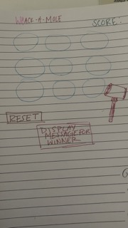

WHACK-A-MOLE
Whack the moles whenever you see them, make sure not to hit the holes too early or late or it will close. If you run out of holes the game will end. The only way to win is to hit the moles 15 times in a row with no misses.
Use your cursor to click on each hole when you see a mole inside!

TECHSTACK 
- USE HTML, CSS, JAVASCRIPT(DOM)

MVP GOALS
- Have a score display and reset button 
- Have gameboard with 9 holes
- When player loses, display game over
- If player wins, display winner message
- Allow mole to appear in circles 
- Cover holes when a player clicks on or misses hole early/late

STRETCH GOALS
- Make cursor a hammer
- Style game with css
- Add background gameplay music
- Create a pause button

POTENTIAL ROADBLCOKS
- Allowing points to add up if player hits moles continiously in a row
- Getting the mole to randomly pop up in the holes

