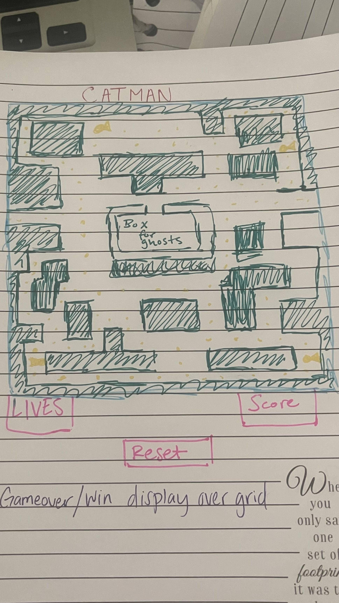

Catman is hungry and it's lunch time! Everytime catman goes out to eat, there are dogs trying to chase him. If the dogs get to him, he will lose one of his precious catman lives. Help catman collect all the fishes before the dogs get to him. There are power fishes that will make the dogs scared of catman and run from him. If catman gets to the dogs, while in power mode, the dogs will go back to their dog house.

TECHSTACK 
- USE HTML, CSS, JAVASCRIPT(DOM)

MVP Goals
- Display a start button and a reset button
- During gameplay, allow player score and lives to display 
- Allow dogs to be operated by AI
- Allow the cat to eat the fish and when eating the power fish, make dogs run away from player(if catman collides with dog, send dog back to its' home)
- Display game over if player loses, or winning display for win
- Allow catman to be controlled by mouse or w, a, s, d keys
- Create a grid for the gameplay
- When dogs collide with catman, display catman losing a life 

 Stretch Goals
- Change color of dogs when catman is in power mode
- Set different difficulty game modes
- Allow player to choose what color mode they choose
